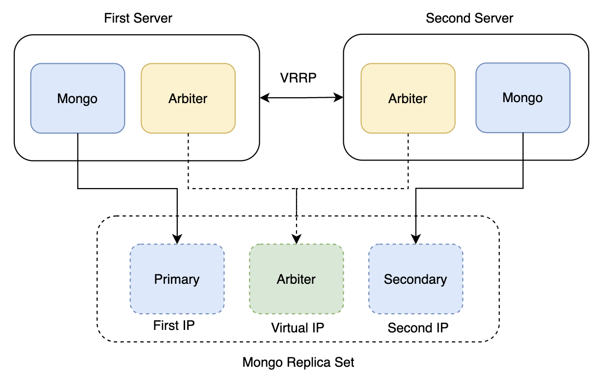

# mongo replica set under VRRP

## preambula

Sometimes for some reason, everyone needs to run mongo db in high availability mode only **on two servers**. 
And it can be done by using **VRRP** protocol under **keepalived**.

To make it happen PSA with two arbiters is used. But after small redesign - arbiter exposes port on Virtual IP, 
that's why it's only one arbiter connected to the Replica set.

Schema: 


## limitation and failover

We consider some limitations and set that:

1. VRRP is trusted and split brain is ridiculous 
2. Data may be lost (it's not a bank application) 

After that failover is as easy as it gets:
1. Master goes down with Mongo and the arbiter
2. Keepalived set the old backup to be a new master with virtual IP moving to a new server
3. Arbiter on old backup starts to be accessible via virtual IP
4. Replica set holds two out of three nodes (mongo and Arbiter) and a new primary can be elected  


## install

Example for Debian / Ubuntu (same on both servers):

1. Install docker, keepalived: 
```bash

curl -sSl https://get.docker.com | sh
sudo apt update && sudo apt install keepalived

```

2. Creates work directories:
```bash
mkdir -p /opt/mongo/data /opt/mongo/config
```

3. Copy files from repo to config workdir:
```bash
cp scripts/env.sh scripts/start.sh scripts/stop.sh scripts/set_state.sh /opt/mongo/config
cp docker-compose.yml /opt/mongo/config
```

4. Copy and change keepalived configuration:
```bash
cp keepalived.conf /etc/keepalived/keepalived.conf
vim /etc/keepalived/keepalived.conf
sudo service keepalived restart
```

5. Setup env variables with actual IP addresses for both servers:
```bash
FIRST_IP="192.168.0.1" SECOND_IP="192.168.0.2" VIRTUAL_IP="192.168.0.3" bash /opt/mongo/config/env.sh
```

6. Run start command:
```bash
bash /opt/mongo/config/start.sh
```

7. Voila, now after 20-40 seconds you will have configured mongodb replica set

## usage

To connect from any of internal or external service use standard mongodb replica protocol:

```bash

MONGODB_URL="mongodb://$mongo1:30001,$mongo2:30001,$mongo3:30001/?replicaSet=rs0&readPreference=secondaryPreferred"

```

## copyright

Daniil Sliusar, 2023